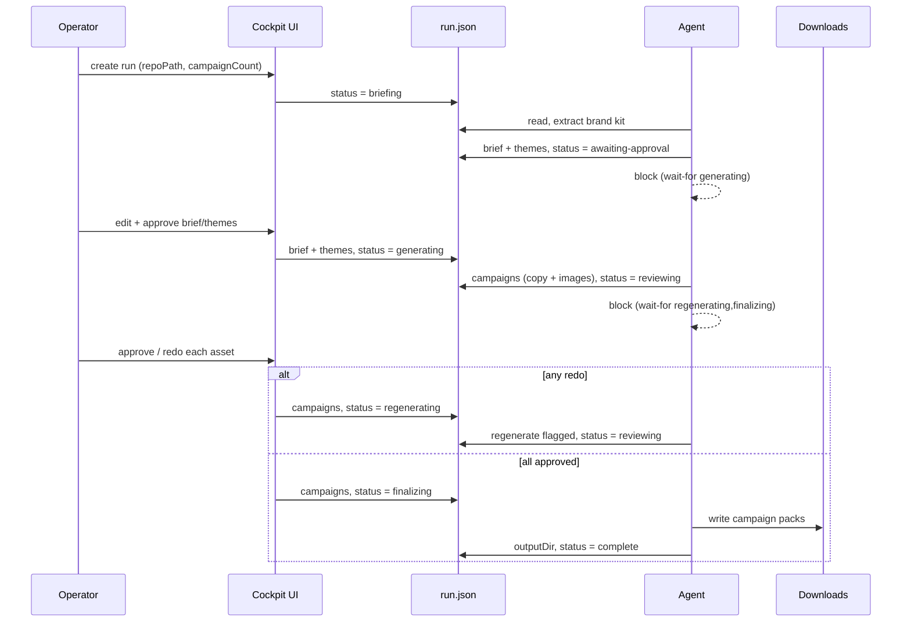
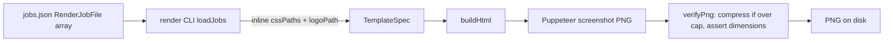

# Components

This document describes the major building blocks in more detail than the
[overview](overview.md), focusing on responsibilities and the data that flows
between them. It is language-agnostic; for the enforced layering rules see
[Explanation: architecture boundaries](../explanation/architecture-boundaries.md).

## The run lifecycle as data

A run is a single `RunState` object that accretes fields as it progresses:

## Brand-kit extraction

Two extractors feed a single entry point (`extractBrandKit`):

- **Manifest extractor** (`manifest.ts`) — reads
  `docs/design-system/_ds_manifest.json` (a Claude-Design package): tokens,
  brand fonts, global CSS paths, ranked logo assets, and voice text assembled from
  a `brand-voice.html` and/or `SKILL.md`.
- **CSS fallback** (`cssFallback.ts`) — when no manifest exists, parses Tailwind
  v4 `@theme` blocks out of a global stylesheet, classifies each `--token` by
  prefix, derives font families, and probes conventional logo locations. Voice is
  `null` (the agent then infers it from the repo's user-facing copy).

The manifest source is preferred; the fallback is used only when it is absent.
The result is a `BrandKit` consumed both by the agent (for copy voice and render
inputs) and, downstream, by the render pipeline via each job's palette, fonts,
CSS paths, and logo.

## Copy validation

`src/domain/validation/copy.ts` validates the three copy shapes
(`RsaCopy`, `PmaxCopy`, `MetaCopy`) against platform field counts and per-field
character limits. Character counting uses grapheme segmentation, not UTF-16 code
units, so emoji and combined characters count the way the platforms count them.
RSA and PMax short headlines are additionally checked for near-duplicates using
Jaccard word overlap, because ad platforms discard near-duplicate headlines.

Validation is invoked in two places: by the agent before it saves copy, and by the
UI's `submitReviewsAction` as a gate before leaving the review phase — so
operator inline-edits cannot ship invalid copy.

## Render pipeline

The CLI reads file references (`cssPaths`, `logoPath`) and inlines them into a
`TemplateSpec` (CSS text and a data URI). `buildHtml` produces static HTML from
one of five templates. Puppeteer screenshots it at the exact viewport size; Sharp
compresses if the PNG exceeds the byte cap and then asserts the output is
pixel-exact, throwing otherwise. One shared browser renders all jobs; the first
failure aborts the batch.

## Cockpit UI

Server components read state through the store and render one of three
interactive surfaces based on `status`:

- **Home** (`page.tsx`) — run list + create form.
- **Approval form** (`ApprovalForm.tsx`) — editable brief and themes; submitting
  runs `approveBriefAction`.
- **Review gallery** (`ReviewGallery.tsx`) — a client component holding local
  campaign state; per-asset approve/redo controls and inline copy editing;
  submitting runs `submitReviewsAction`.

While the agent works, `AutoRefresh` polls and re-renders so the operator sees
status changes without manual refresh. Images are served by the `/api/asset`
route, which reads run-relative files through the store's path-guarded reader.
