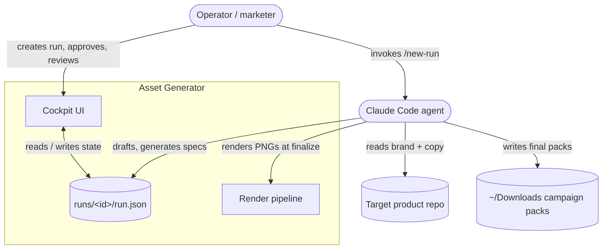
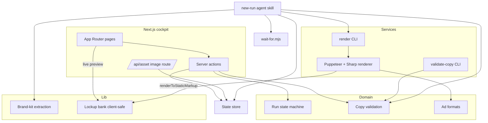

# Architecture overview

Asset Generator is a local, two-actor system with a single shared state file. This
document describes the system context (who and what it interacts with) and the
container view (the runtime pieces and how they coordinate).

## System context

The **operator** drives the agent from a Claude Code session and approves work in
the UI. The **agent** reads the target repo and does all generation. The two
communicate only through `run.json`. Finished packs land in the operator's
Downloads directory.

## The coordination model

`run.json` is the single interface between the UI and the agent. It carries a
`status` field that acts as a state machine. Ownership of transitions is split:

| Transition                       | Owner | Meaning                                    |
| -------------------------------- | ----- | ------------------------------------------ |
| `briefing → awaiting-approval`   | Agent | Brief and themes drafted, ready for review |
| `awaiting-approval → generating` | UI    | Operator approved the brief and themes     |
| `generating → reviewing`         | Agent | Copy and creative specs produced (no PNGs) |
| `reviewing → regenerating`       | UI    | Operator flagged one or more redos         |
| `reviewing → finalizing`         | UI    | Operator approved everything               |
| `regenerating → reviewing`       | Agent | Flagged assets regenerated                 |
| `finalizing → complete`          | Agent | Final packs written to Downloads           |

The machine only moves forward; `complete` is terminal. The legal transitions are
defined in `src/domain/run.ts` (`canTransition`) and the status list in
`src/types/run.ts`.

See [Explanation: coordination model](../explanation/coordination-model.md) for
why this design was chosen and how atomic writes and blocking work.

## Container view

### Cockpit UI (`src/app/`)

A Next.js App Router application. Pages list and create runs, show the approval
form, and show the review gallery — which previews each creative live by mounting
the shared lockup component in the browser and scaling it to fit. Server actions
(`actions.ts`) perform the UI-owned status transitions and persist operator edits.
An asset route (`/api/asset`) streams run-relative files (images, brand CSS, logo)
by MIME type to the previews and gallery.

### State store (`src/lib/state/store.ts`)

The only reader/writer of `run.json`. Writes are atomic (temp file + rename) so a
concurrent watcher never sees a torn file. Provides run listing and a
path-escape-guarded asset reader.

### Domain (`src/domain/`)

Pure business logic with no I/O: the run state machine (`run.ts`), per-platform
copy validation (`validation/copy.ts`), and the ad-format specifications
(`formats.ts`).

### Brand-kit extraction (`src/lib/brandkit/`)

Reads a target repo and produces a `BrandKit`: tokens, fonts, logos, CSS paths,
and voice. Prefers a Claude-Design `docs/design-system` manifest; falls back to
parsing a global stylesheet's Tailwind `@theme` blocks.

### Lockup bank (`src/lib/lockups/`)

A small, fixed library of seven hand-designed ad layouts authored as one
client-safe React module (no `react-dom/server`). They carry no brand values — a
`CreativeSpec` supplies lockup, palette, and copy, and fonts/CSS/logo/image arrive
alongside. The same component tree renders live in the cockpit and to a PNG at
finalize. `LOCKUP_META` declares each lockup's required/optional copy slots and
whether it needs an image; `missingSlots` validates a spec at the finalize gate.

### Render pipeline (`src/services/render/`)

Turns a `RenderSpec` into a verified PNG at finalize using Puppeteer (headless
Chrome screenshot of the lockup rendered via `renderToStaticMarkup`) and Sharp
(compression + pixel-exact dimension check). The `render` CLI loads a `jobs.json`
of flat `RenderJobFile` entries, inlining CSS, logo, and image file references.

### Saved-copy validation (`src/services/validate-copy/`)

The `validate-copy` CLI validates one saved copy file, or a named batch file of
several entries via `--batch`, delegating runtime shape checks and platform
rules to the domain's `validateCopy` / `validateCopyBatch` entry points. It
returns a JSON result or a concise error with an exit code, without changing
files or run state. See [command reference](../reference/commands.md#validate-saved-copy).

### Agent skill (`.claude/skills/new-run/SKILL.md`)

The instructions the Claude Code agent follows to run the whole workflow. It is
not application code, but it is the other half of the system.

### Wait helper (`scripts/wait-for.mjs`)

Blocks the agent until `run.json` reaches a target status, using a directory watch
plus a poll fallback. This is how the agent parks itself while the operator acts.

## Deployment

This is a local developer tool. There is no server deployment: `pnpm dev` runs the
Next.js cockpit on `localhost:3000`, the agent runs in a local Claude Code
session, and all state and output are local files. Puppeteer downloads and drives
a local headless Chrome for rendering.
