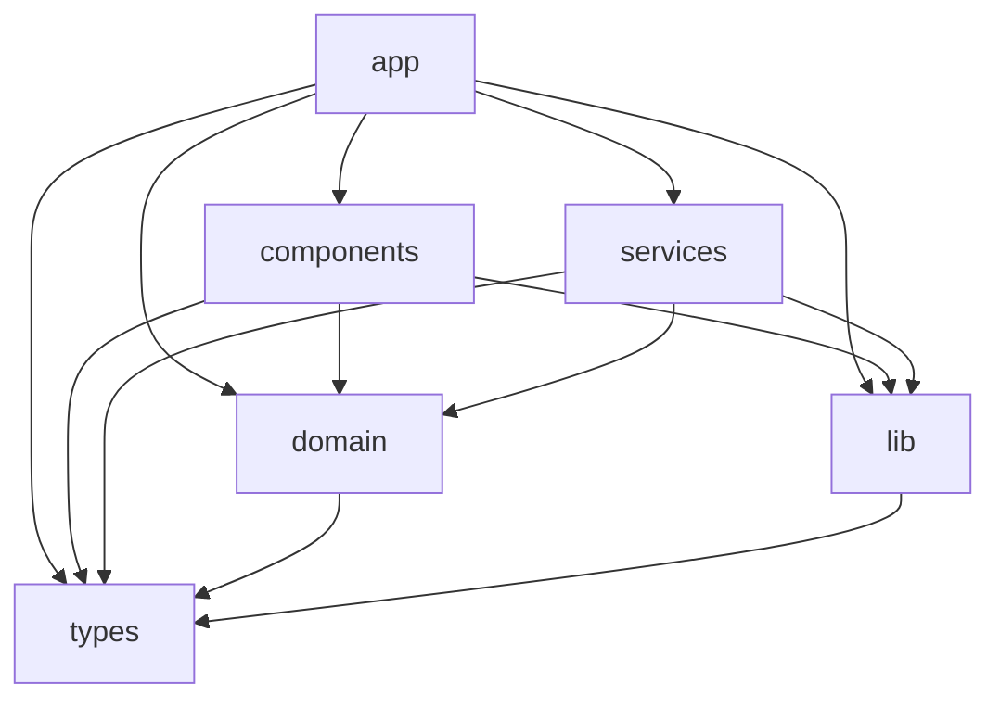

# Architecture boundaries

This document explains the layered structure of `src/` and why the dependencies
between layers are constrained. The rules are enforced, not aspirational: ESLint
(`eslint-plugin-boundaries`) and dependency-cruiser fail the build on a violation.

## The layers

| Layer        | Location          | Responsibility                                               |
| ------------ | ----------------- | ------------------------------------------------------------ |
| `app`        | `src/app/`        | Next.js pages, server actions, API routes.                   |
| `components` | `src/components/` | Reusable UI: auto-refresh, live creative previews.           |
| `services`   | `src/services/`   | Orchestration, e.g. the render pipeline.                     |
| `domain`     | `src/domain/`     | Pure business logic: run state machine, validation, formats. |
| `lib`        | `src/lib/`        | Infrastructure: state store, brand-kit extraction, lockups.  |
| `types`      | `src/types/`      | Shared type definitions (leaf).                              |
| `utils`      | `src/utils/`      | Shared helpers (leaf).                                       |
| `config`     | `src/config/`     | Configuration (leaf).                                        |

## The dependency rule

The allowed edges (from `eslint.config.mjs`):

Everything not drawn is disallowed by default (`boundaries/no-unknown` is an
error, so an unclassified file also fails).

Notable constraints and their intent:

- **Domain depends only on `types`/`utils`.** The run state machine, copy
  validation, and format specs are pure and portable — they can be imported by the
  UI, the services, and the agent's tooling without dragging in Next.js, the
  filesystem, or the renderer. This is why validation runs identically in the
  agent and in the UI's submit gate.
- **Components may not import services.** UI components reach data through server
  actions or props, never by calling the orchestration layer directly. This keeps
  rendering server/client boundaries clean in the App Router.
- **`lib` is infrastructure and may not import `domain` or `services`.** The
  state store and brand-kit extractor are low-level; keeping them below the domain
  prevents cyclic coupling between "how we persist" and "what the rules are".
- **`types`, `utils`, `config` are leaves.** They carry no logic dependencies, so
  they can be imported anywhere without creating cycles.

## Why enforce it in tooling

The layering is only useful if it holds. Two independent checks guard it:

- **`eslint-plugin-boundaries`** classifies each file by its folder and rejects
  disallowed imports at lint time (`pnpm lint`).
- **dependency-cruiser** (`pnpm deps:validate`) validates the module graph and can
  emit it as an SVG (`pnpm deps:graph`).

Both run in `pnpm quality`. A tempting shortcut — say, a component importing the
render service directly — fails the build rather than silently eroding the
structure.

## Supporting conventions

Two other enforced rules keep the module graph legible:

- **Absolute imports only.** `no-relative-import-paths` requires the `@/` alias
  (mapped to `src/` in `tsconfig.json`) except within the same folder. Imports
  read the same regardless of file depth.
- **Strict, type-checked linting.** The TypeScript config uses
  `strictTypeChecked` + `stylisticTypeChecked` with unsafe-operation rules set to
  error, so the boundaries are crossed by well-typed code or not at all.
